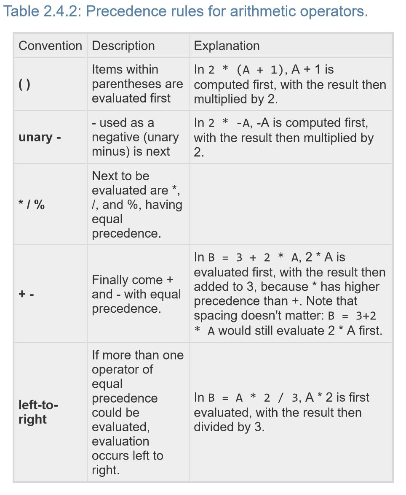
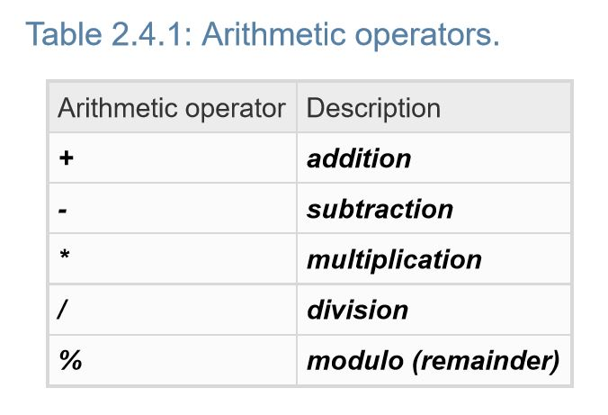

# Precedence Rules 

### An expression is a combination of items, like variables, literals, and operators, that  evaluates to a value. 
### These expressions can sometimes get tricky depending on what is trying to be achieved. 
#### Here are some basic things to keep in mind when evaluating expressions. 

A **literal** is a specific value in code like 1.

Brackets **[ ]** or braces **{ }** may NOT be used when calculating expressions

###### Integer and Double Addition and Subtraction are pretty simple and are displayed in the PrecedenceRules.java program

###### Integer Division
When the operands are **integers**, the division operator **/** performs integer division, throwing away any remainder.

Example:
 
**24 / 10** - The output would be **2**, where the remainder **4** would be thrown away.

**1 / 2** - An expression that preforms integer division, evaluating to **0**.

##### Note for integer division
For integer division, the second operand of **/** or **%** must never be **0**, because division by **0** is mathematically undefined. Division by **0** causes a program to terminate.

###### Double Division
When the operands are in the form of a **double** primitive data type, the division operator **/** performs division, 
keeping the remainder.

Example:
**1.0 / 2.0** - An expression that preforms double division, evaluating to **0.5**.

###### Modulo Operator 
The modulo operator **%** evaluates to the remainder of the division of two integer operands.

Example:
**24 % 10** - An expression that evaluates to **4**. 

**10 % 10** - An expression that evaluates to **0** because **10 / 10** is **1** with a remainder **0**.

**1 % 2** - An expression that evaluates to **1** because **1 / 2** is **0** with a remainder **1**. 

#### Precedence Rules for arithmetic operators 

It's **Good practice** to use parentheses to make order of evaluation explicit, rather than relying on precedence rules, 
as in: **y = (m \* x) + b**, unless order doesn't matter as in **x + y + z**.

#### Arithmetic Operators

#### Compound Operators 
Compound operators provide a shorthand way to update a variable, such as currentNum **+=** 1 being shorthand for **currentNum = currentNum + 1**. Other compound operators include **­=**,  __\*=__, **/=**, and **%=**.

### [Check out the PreceedenceRules.java program that goes along with this Markdown File, click this to see it](https://github.com/matthew9510/Zybooks/blob/master/src/Variables/PrecedenceRules.java)