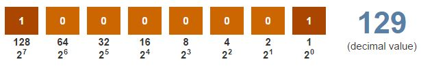

# Binary Background

Normally, a programmer can think in terms of base ten numbers. 

However, a **compiler** must allocate some finite quantity of bits (e.g., 32 bits) for a variable, and that **_quantity of bits_** **limits the range of numbers** that the variable can represent. 

Thus, understanding how the quantity of bits influences a variable's number range is useful.

Because each memory location is composed of bits **(0s and 1s)**, a processor stores a number using **base 2**, _known as a binary number_. 

For a number in the more familiar to humans is **base 10**, _known as a decimal number_, each digit **must be 0-9** and each digit's place is weighed by increasing powers of 10. So the decimal number 212 represents **(2 * 10^2) + (1 * 10^1) + (2 * 10^0)** = (2 * 100) + (1 * 10) + (2 * 1) = 200 + 10 + 2 = 212. 

In base 2, each digit **must be 0 or 1** and each digit's place is weighed by increasing **powers of 2**. So the binary number 1101 represents **(1 * 2^3) + (1 * 2^2) +  (0 * 2^1) + (1 * 2^0)** Which is equivalent **(in base 10)** as (1 * 8) + (1 * 4) + (0 * 2) + (1 * 1) = 8 + 4 + 0 + 1 = 13.

Check out this visual 

#### Behind the scenes 
The compiler **translates** decimal numbers into binary numbers ***before*** storing the number into a memory location. 

**For example:** The compiler would convert the decimal number 212 to the binary number 11010100, meaning **(1 * 128) + (1 * 64) + (0 * 32) + (1 * 16) + (0 * 8) + (1 * 4) + (0 * 2) + (0 * 1)**, and stores that **binary number** in memory.