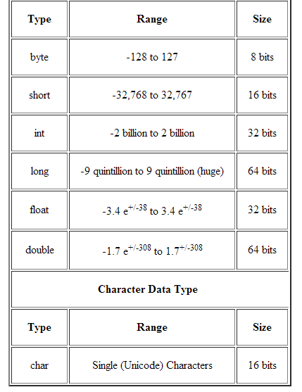

# Java Primitive types 

## The language java has EIGHT built in data types
#### I personally like to think of them as storage containers for specific data types to store. 
## Types

#### Non-Arithmetic types:
 * ***boolean***, _Default value_: **False**
     * _Boolean_ type store values that are either true or false.
 * ***char***, _Default value_: **'\u0000'**
     * The character type whose values are **16-bit Unicode characters**
     * A common **error** is to use double quotes rather than single quotes around a character literal, 
       as in myChar = **"x"**, yielding a compiler error. 
     * Similarly, a common error is to forget the quotes around a character literal, as in myChar = **x**,
      usually yielding a compiler error (may not if x is a variable, leading to a logic error).
#### Arithmetic types:
##### integral types _(whole number)_ types:
* ***byte***, _Default value_: **0**
* ***short***, _Default value_: **0**
* ***int***, _Default value_: **0**
* ***long***, _Default value_: **0L**
##### floating-point _(decimal number)_ types:
* ***float***, _Default value_: **0.0f**
* ***double***, _Default value_: **0.0d**

 
 # BE CAREFUL 
 #### Compilers may not detect overflow in calculations and thus not generate a warning; the program simply runs incorrectly.
 ***A common source of overflow involves intermediate calculations.***
 
 Given **int** variables num1, num2, num3 each with values near 1 billion, **(num1 + num2 + num3) / 3** will encounter
 overflow in the numerator, which will reach about 3 billion **(max int is around 2 billion)**.
 _Even though the final result after dividing by 3 would have been only 1 billion._ 
 
 **Dividing earlier** can sometimes solve the problem, as in **(num1 / 3) + (num2 / 3) + (num3 / 3)**, but programmers
 should pay careful attention to possible implicit type conversions.